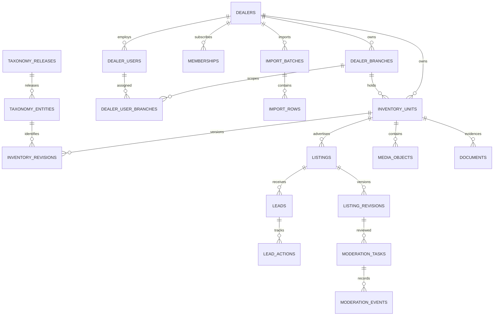

# Expiya İkinci El — Tenant/branch ERD ve composite-key sözleşmesi v0.1

Durum: Migration öncesi teknik sözleşme; uygulanmış şema değildir.

## Şema sınırı

- Bütün tablolar ayrı `used_cars` şemasındadır.
- Global taxonomy tabloları platform-owned; partner CRUD erişimine kapalıdır.
- Tenant-owned tablolarda `tenant_id uuid not null` bulunur.
- Branch-owned tablolarda `tenant_id` ve `branch_id` birlikte bulunur.
- Global UUID foreign key tenant izolasyonu için tek başına kullanılamaz.

## ERD

## Anahtar sözleşmeleri

| Tablo | Primary/unique sahiplik anahtarı | Zorunlu composite FK |
|---|---|---|
| `dealers` | `(id)` | — |
| `dealer_branches` | `(tenant_id, id)` | `tenant_id → dealers.id` |
| `dealer_users` | `(tenant_id, id)` | `tenant_id → dealers.id` |
| `dealer_user_branches` | `(tenant_id, user_id, branch_id)` | `(tenant_id,user_id)`, `(tenant_id,branch_id)` |
| `memberships` | `(tenant_id, id)` | `tenant_id → dealers.id` |
| `inventory_units` | `(tenant_id, id)` | `(tenant_id,branch_id)` |
| `inventory_revisions` | `(tenant_id, inventory_unit_id, id)` | `(tenant_id,inventory_unit_id)` |
| `listings` | `(tenant_id, id)` | `(tenant_id,inventory_unit_id)` |
| `listing_revisions` | `(tenant_id, listing_id, id)` | `(tenant_id,listing_id)` ve inventory revision aynı tenant |
| `media_objects` | `(tenant_id, id)` | `(tenant_id,inventory_unit_id)` |
| `documents` | `(tenant_id, id)` | `(tenant_id,inventory_unit_id)` |
| `leads` | `(tenant_id, id)` | `(tenant_id,listing_id)`, `(tenant_id,branch_id)` |
| `lead_actions` | `(tenant_id, lead_id, id)` | `(tenant_id,lead_id)` |
| `import_batches` | `(tenant_id, id)` | `tenant_id → dealers.id` |
| `import_rows` | `(tenant_id, batch_id, row_number)` | `(tenant_id,batch_id)` |

## Platform-owned tablolar

`taxonomy_releases`, `taxonomy_entities`, `taxonomy_assertions`, `taxonomy_identity_requests`, `moderation_tasks`, `moderation_events`, `fraud_cases` ve global audit shard'ları partner tenant ownership modelinden ayrıdır. Partner bunlara base-table CRUD yapamaz; yalnız allowlisted view veya service sonucu görür.

## Tenant invariants

1. Child satırın `tenant_id` değeri parent foreign key'in parçasıdır.
2. `tenant_id` UPDATE edilemez; tenant taşıma yeni kayıt ve denetimli operasyon gerektirir.
3. Branch-scoped kaynak başka tenant veya şubeye bağlanamaz.
4. Inventory revision immutable'dır; düzeltme yeni revision üretir.
5. Listing revision exact inventory revision'a bağlanır.
6. Lead recipient tenant ve branch, listing snapshot'ından server-side türetilir.
7. Import satırındaki tenant request dosyasından kabul edilmez.
8. Object-storage key'i DB'deki tenant ownership kararı olmadan yetki kaynağı değildir.

## Public projection sınırı

Public reader base tabloları okuyamaz. `published_listing_projection` şu alanları içeremez:

- tenant/branch internal ID,
- VIN/plaka ciphertext veya fingerprint,
- maskeli VIN/plaka,
- private source reference,
- belge object key,
- kullanıcı/actor ID,
- internal moderasyon/fraud notu.

## Silme ve kapanma

- Tenant `SUSPENDED/CLOSED` olduğunda projection sonucu atomik olarak boşalır.
- Tenant-owned satırların fiziksel silinmesi retention matrisiyle yürür.
- Composite key'ler nedeniyle parent silme varsayılan `RESTRICT`; kontrolsüz `CASCADE` kullanılmaz.
- Quarantine ve backup imhası DB foreign key cascade'ine bırakılmaz.

## Migration review checklist

- Her tenant-owned FK'de `tenant_id` var mı?
- Her branch FK'si `(tenant_id, branch_id)` kullanıyor mu?
- Her tenant tabloda `ENABLE` ve `FORCE ROW LEVEL SECURITY` var mı?
- Runtime roller table owner veya `BYPASSRLS` mı? Cevap hayır olmalı.
- Public role yalnız projection view erişimine sahip mi?
- Tenant değişikliği UPDATE ile mümkün mü? Cevap hayır olmalı.
- `ON DELETE CASCADE` yalnız açıkça incelenmiş tablolarda mı?
